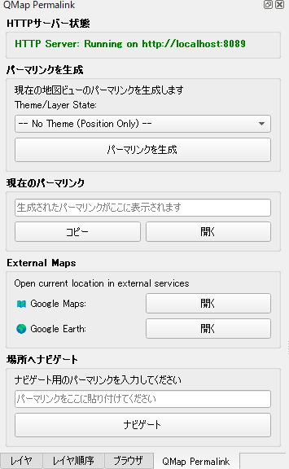
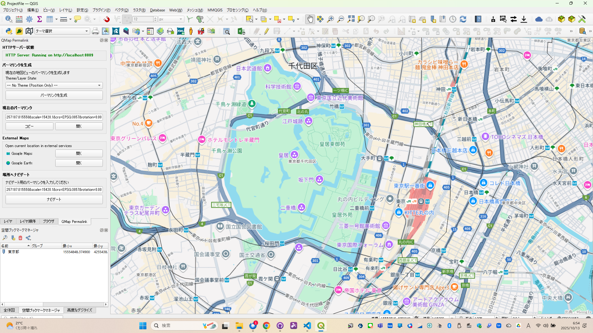

# QMapPermalink

QGISの地図ビューを外部から直接ナビゲートするパーマリンクプラグイン  
最新のZIPはこちらから　https://github.com/yamamoto-ryuzo/QMapPermalink/tree/main/dist

**Version 2.1.0** - WMS配信対応と外部アクセス改善

## 概要

QMapPermalinkは、QGISのマップ位置や状態（レイヤー、テーマ、スタイル）を固定リンク化し復元可能にするパネル型プラグイン。  
内蔵HTTPサーバでWMSとOpenLayers地図を公開し、外部から直接ナビゲーション可能。
<table>
   <tr>
      <td></td>
      <td></td>
   </tr>
</table>

## 主な特徴

- **HTTPパーマリンク生成**: QGISの地図画面をHTTPサーバー経由でアクセス可能なURLとして生成
- **🎨 テーマ・レイヤー状態の保存**: マップテーマやレイヤーの表示状態、スタイル情報をパーマリンクに含める
- **🔗 ワンクリック外部連携**: Google Maps・Google Earthボタンで現在位置を瞬時にブラウザで開く
- **🗺️ OpenLayersマップ統合**: HTTPレスポンスにインタラクティブなWebマップを埋め込み、QGISビューをブラウザで再現
- **🗺️ Google Maps連携**: 同一地点のGoogle Mapsハイパーリンクを自動生成、小数点ズーム対応で高精度
- **🌍 Google Earth連携**: 実測データに基づく正確なGoogle Earth URLを自動生成、適切な高度・距離・角度で表示
- **権限不要の外部連携**: ExcelやPDFなどの資料にHTTPリンクを埋め込み、管理者権限なしでクリック可能
- **瞬時ナビゲーション**: ブラウザ経由でQGIS内の指定位置に瞬時にジャンプし、地図ビューを再現
- **完全な地図状態復元**: 位置だけでなく、レイヤー表示設定やテーマも含めた完全な復元
- **軽量HTTPサーバー**: Python標準モジュールで実装された内蔵サーバー（ポート自動選択）
- **🔧 モジュラー設計**: HTTPサーバー機能を独立したマネージャーに分離、保守性と拡張性を向上
- **🛡️ 安定性向上**: サーバー機能の独立により、エラー処理とメンテナンスが簡素化
- **パネルUI**: ドッキング可能なパネル形式で効率的なワークフロー
- **自動タブ化**: 既存の左側パネル（レイヤーパネルなど）と自動的にタブ化
- **多言語対応**: 日本語、英語、フランス語、ドイツ語に対応

## UI形式

QMapPermalinkはパネル（Panel）形式のUIを提供します：

### パネル（Panel）形式
- QGISの左側ドックエリアにドッキング可能なパネル
- 既存のパネル（レイヤーパネル、ブラウザパネルなど）と自動的にタブ化
- 常時アクセス可能で、ワークフローの効率化が可能
- QGISの他のパネルと同様に管理・移動可能
- 完全な多言語対応UI（日本語、英語、フランス語、ドイツ語）

## 使用例

1. **資料作成時**
   - QGISで地図の特定箇所を表示
   - QMapPermalinkでパーマリンクを生成
   - ExcelやPDFの説明資料にリンクを埋め込み

2. **資料閲覧時**
   - 資料内のリンクをクリック
   - QGISが自動的に該当箇所へジャンプ
   - 説明内容と地図画面が瞬時に連携

3. **パネル形式での効率的なワークフロー**
   - パネルを常時表示して作業
   - 複数のパーマリンクを素早く生成・管理
   - Google Maps・Google Earth連携でブラウザ確認もワンクリック

## コンセプト

QMapPermalinkは、**「QGIS上で地図の特定表示状態を固定的に示し、そのリンク経由で外部から画面を素早く操作・移動できる画期的な仕組み」**を表現しています。

これにより、説明資料とQGISのマップ画面を密接に結びつけ、空間情報の共有・説明の効率化を実現します。

#### 🚀 現行バージョンで提供している機能
-
※ 本リリース (v2.0.0) では、組み込みHTTPサーバーに WMS（Web Map Service）1.3.0 互換の配信機能を追加しました。WMS エンドポイントにより外部の GIS クライアントやブラウザから QGIS の地図を直接参照できます。さらに、`/qgis-map` エンドポイントは OpenLayers を使ったインタラクティブなウェブマップを返すため、QGIS は単なるクライアントではなく、ローカルホスト（または指定したホスト/IP）上で「WMS サーバー」および「OpenLayers を配信するウェブサーバー」として動作します。開発・検証用途で外部アクセスを許可するため、サーバーは全インターフェース（0.0.0.0）にバインドされます。運用時は適切なネットワーク制御・ファイアウォール設定を行ってください。

- **統合パネルUI**: QGISの左側に常時表示されるドッキングパネル
- **自動タブ化**: レイヤーパネルなど既存パネルと自動的にタブ化
- **HTTPサーバー**: QGIS起動時に自動起動、`/qgis-map` エンドポイントで地図移動

Note: If you access the plugin's endpoints from a different host/IP (for example http://192.168.0.5:8089/qgis-map...), the plugin will now treat any http(s) URL whose path contains `/qgis-map` or `/wms` as an internal navigation request and will apply the navigation in QGIS. Previously only `localhost` URLs were considered internal. Ensure firewall and network settings allow access to the plugin port when using remote hosts.
- **🗺️ OpenLayersマップ**: HTTPレスポンスにインタラクティブなWebマップを埋め込み（地理院地図+OSM）
- **座標パラメータ**: `ll`・`lat/lon`・`x/y` などの座標パラメータ対応（`crs` と `scale`/`rotation` 併用可能）
- **🗺️ Google Maps連携**: 応答ページに同じ地点のGoogle Mapsリンクを含む（小数点ズーム対応）
- **🌍 Google Earth連携**: 実測データベースによる正確なGoogle Earth URLを自動生成
- **完全多言語対応**: プラグインメッセージとパネルUIの両方を翻訳

### 既定のパーマリンク形式（シンプルURL）

デフォルトで生成されるパーマリンクは短い `x/y/scale` 形式です（外部資料での共有に最適）。rotation も含めて送信できます。

#### 基本的なパーマリンク例

例（WGS84）:
```
http://localhost:8089/qgis-map?x=139.01234&y=35.12345&scale=1000.0&rotation=0.00
```

例（投影座標、CRS 指定）:
```
http://localhost:8089/qgis-map?x=15617768.94&y=4345862.78&scale=1440000.0&crs=EPSG:3857&rotation=12.34
```

#### 🎨 テーマ情報を含むパーマリンク例

テーマを含む場合（V1.4.0以降、V1.5.4でシンプル化）:
```
http://localhost:8089/qgis-map?x=139.01234&y=35.12345&scale=1000.0&crs=EPSG:4326&rotation=0.00&theme=StandardMap
```

`theme`パラメータには既存のマップテーマ名をそのまま指定します。V1.5.4でJSON形式から単純なテーマ名形式に変更し、URLが軽量で読みやすくなりました。

### シンプルURL例

短い形式での利用例（推奨）:

```
http://localhost:8089/qgis-map?x=139&y=35&scale=1000.0
```

この形式は `x`（経度）と `y`（緯度）を直接指定するため、URLが非常に短くなり、Excelやドキュメントで取り扱いやすくなります。デフォルトの `crs` は `EPSG:4326` として解釈されます。

## 投影 (CRS) ポリシー（重要）

このプラグインの実装方針は以下の通りです（コード実装に一致しています）。

- OpenLayers（ブラウザ上の表示）は常に EPSG:3857（Web Mercator）で固定されています。クライアント側での表示・操作は EPSG:3857 前提で行われます。
- WMS エンドポイントは複数の EPSG（例: EPSG:4326, EPSG:3857, その他プロジェクション）を受け付けます。サーバはリクエストで指定された CRS を尊重してレンダリング可能ですが、OpenLayers に返却・表示する際は内部で EPSG:3857 に変換してから返却する、という動作を行います。

この方針により、外部 GIS クライアントからは任意の CRS で WMS GetMap を要求できますが、ブラウザで配信するインタラクティブなビューは常に EPSG:3857 で一貫した表示が得られます。

（注）内部処理は QGIS の座標変換（QgsCoordinateTransform）を用いて行われます。プロジェクト環境によっては特定 CRS の proj4 定義が必要になる場合があります。

### 回転対応ポリシー（v2.5.x）

- 基本方針: WMS は内部で指定角度でレンダリング（地物・ラベルを含む）。サーバ側で出力画像を逆回転して north-up の矩形 PNG に補正して返却し、クライアント（OpenLayers）はその north-up 画像を受け取ってから view.rotation で表示回転を行います。
- 利点: サーバ側の高品質なラベル配置を活かしつつ、クライアント上で他レイヤー（タイルやベクター）との座標整合を保てます。
- 注意点: 画像の逆回転によるピクセル補間や切り抜きに注意。大解像度でのレンダリングは処理コストが高くなるため、必要に応じて余白付きレンダリングやサーバーキャッシュを検討してください。


### 🌍 Google Earth統合機能（V1.6.0新機能）

パーマリンクにアクセスすると、応答ページにGoogle Maps・Google Earthの両方のリンクが自動生成されます：

#### 実測データに基づく高精度Google Earth URL

V1.6.0では、実際のGoogle Earthの動作を詳細に分析し、実測データに基づいて正確なパラメータを計算します：

- **実測基準**: スケール1:15695 → 高度32.04m、距離160699m、角度1y
- **比例計算**: スケール値に応じて高度・距離を適切に調整
- **統一計算**: Google Mapsと同じズームレベル計算で一貫性を確保

**例**: スケール1:15695の場合
```
🗺️ Google Maps: https://www.google.co.jp/maps/@35.683709,139.759407,15.35z
🌍 Google Earth: https://earth.google.com/web/@35.683709,139.759407,32.03670052a,160699.35527964d,1y,0h,0t,0r
```

#### Google Earth URLパラメータの詳細

- **@lat,lon**: 緯度・経度（WGS84）
- **altitude**: 視点の高度（実測データに基づく計算）
- **distance**: カメラ距離（スケールに比例した適切な値）  
- **1y**: ヨー角（実測に基づく適切な表示角度）
- **0h,0t,0r**: ヘディング・チルト・ロール（固定値）

注意: プラグインは `scale` を標準パラメータとして扱います。`zoom` は QGIS のスケールを正確に表現できない場合があるため、基本的には `scale` を使ってください。`zoom` は主に Google Maps へ渡すための推定値としてオプションで利用されます。


**Excel / PDF / Web文書での活用例**

| 地点名 | 地図リンク | Google Maps | Google Earth |
|--------|-------------|-------------|-------------|
| 現場A  | http://localhost:8089/qgis-map?x=139&y=35&scale=1000.0 | 🗺️ 自動生成 | 🌍 自動生成 |
| 現場B  | http://localhost:8089/qgis-map?x=139.8&y=35.7&scale=5000.0 | 🗺️ 自動生成 | 🌍 自動生成 |

生成したURLをそのまま貼り付ければ、ブラウザ経由でQGISが該当ビューへ移動し、同時にGoogle Maps・Google Earthのリンクも表示されます。社内資料やメール、チャットでの共有が容易です。

## 🔧 V1.9.0の主要な改良点

### HTTPサーバー機能の分離とアーキテクチャ改善

- **新規ファイル追加**: `qmap_permalink_server_manager.py` - HTTPサーバー専用マネージャークラス
- **コード分離**: メインプラグインクラスからHTTPサーバー機能を完全に独立
- **保守性向上**: サーバー機能の修正・拡張が容易になり、メインロジックに影響しない
- **エラー処理改善**: サーバー関連のエラーが他の機能に波及しない堅牢な設計
- **拡張性確保**: 今後のHTTPサーバー機能強化の基盤を構築

### 技術的改善点

1. **モジュラー設計**: 機能ごとに明確に分離された設計
2. **メソッド参照の最適化**: 共通ユーティリティメソッドは適切にメインクラスに残し、サーバーから参照
3. **初期化順序の改善**: 依存関係を明確にした初期化プロセス
4. **デバッグ機能強化**: 問題箇所の特定が容易になるログ機能

### 開発者向け改善

- **コードベースの整理**: HTTPサーバー関連の修正は `qmap_permalink_server_manager.py` に集約
- **機能追加の簡素化**: サーバー機能の拡張時にメインファイルを変更する必要がない
- **テスト容易性**: サーバー機能の単体テストが独立して実行可能

この改良により、プラグインの安定性と将来の機能拡張への対応力が大幅に向上しました。

### パーマリンクからのナビゲーション

1. パーマリンクURLをコピー
2. パネルの「Navigate to Location」セクションのテキストボックスに貼り付け
3. 「Navigate」ボタンをクリックして地図ビューに移動

### パネルの使用方法

1. **パネルの表示**: ツールバーまたはメニューから「QMap Permalink」をクリック
2. **テーマオプション選択**: ドロップダウンから以下のいずれかを選択
   - `-- No Theme (Position Only) --`: 位置情報のみのシンプルなパーマリンク（デフォルト・推奨）
   - 具体的なテーマ名: プロジェクト内の既存マップテーマを選択してパーマリンクに含める
3. **パーマリンク生成**: 「Generate Permalink」ボタンで選択した設定でリンクを生成
4. **コピー**: 「Copy」ボタンでクリップボードにコピー
5. **ブラウザで開く**: 「Open」ボタンでブラウザでリンクを確認
6. **🔗 外部マップサービス** (V1.7.0新機能):
   - **🗺️ Google Maps**: 「Open」ボタンで現在の地図位置をGoogle Mapsで開く
   - **🌍 Google Earth**: 「Open」ボタンで現在の地図位置をGoogle Earthで開く
7. **ナビゲーション**: 他のパーマリンクを入力して地図を移動

#### 🎨 シンプルテーマ制御機能

- **🎯 シンプルで確実**: 複雑な機能を排除し、確実に動作する2つの選択肢のみ
- **📋 明確な選択肢**:
  - `-- No Theme (Position Only) --`: 位置情報のみ（軽量・高速・推奨）
  - 具体的なテーマ名: プロジェクト内の既存マップテーマを活用（確実な動作）
- **🔄 既存テーマ活用**: QGISで事前に作成されたマップテーマのみをサポート
- **⚡ 高い安定性**: 複雑な現在状態取得を避け、信頼性の高い動作を保証
- **🚀 自動復元**: テーマ付きパーマリンクからナビゲーション時に、レイヤー状態も自動的に復元

## 🧪 デモンストレーション
プラグインの機能を確認するためのデモは過去の配布で提供されていましたが、
このリポジトリの現行ブランチには `demo/` ディレクトリは含まれていません。
配布用 ZIP にデモが同梱されている場合があります。ローカルで動作確認するには
プラグインを QGIS にインストールしてサーバーを起動し、以下のようなエンドポイントをブラウザで確認してください。

```
http://localhost:8089/wms?SERVICE=WMS&REQUEST=GetCapabilities
http://localhost:8089/wms?SERVICE=WMS&REQUEST=GetMap&BBOX=139.5,35.5,139.9,35.9&WIDTH=400&HEIGHT=400&CRS=EPSG:4326&FORMAT=image/png
http://localhost:8089/qgis-map?x=139&y=35&scale=1000.0
```

（注）デモや追加ドキュメントが必要な場合は、配布 ZIP を確認するか Issue を立ててください。

## 開発情報

### ファイル構成（現状）

主要なファイルはリポジトリ内の `qmap_permalink/` ディレクトリに含まれています。現行ブランチにある代表的なファイルは以下の通りです:

```
qmap_permalink/
├── __init__.py
├── qmap_permalink.py
├── qmap_permalink_original.py
├── qmap_permalink_panel.py
├── qmap_permalink_panel_base.ui
├── qmap_permalink_server_manager.py
├── qmap_webmap_generator.py
├── professional_wms_server.py
├── pyqgis_independent_renderer.py
├── metadata.txt
├── icon.png
└── i18n/    (翻訳ファイル: .ts / .qm)
```

※ 以前の README に含まれていた `qmap_permalink_dialog.py` や `qmap_permalink_panel_simple.py` 等のファイルは現行ブランチには含まれていません（CHANGELOG にも廃止が記載されています）。

### 翻訳ファイルのコンパイル

このリポジトリには `.ts` / `.qm` の翻訳ファイルが `qmap_permalink/i18n/` に含まれています。専用の `compile_translations.py` スクリプトは存在しないため、Qt の標準ツールを使ってコンパイルしてください。

例（Qt の lrelease を利用する場合）:

```
lrelease qmap_permalink/i18n/QMapPermalink_ja.ts -qm qmap_permalink/i18n/QMapPermalink_ja.qm
```

または `lupdate` / `pylupdate5` と `lrelease` の組み合わせを利用してください。

### 配布用 ZIP の作成

配布用 ZIP はトップレベルの `create_zip.py` で作成できます。実行すると `dist/` ディレクトリが作成され、ZIP が出力されます。

```
python create_zip.py
```

注意: `create_zip.py` は include リストに基づいてファイル存在チェックを行います。README に記載の古いファイルが含まれている場合、スクリプトは該当ファイルが見つからない旨を出力します。実行前に `create_zip.py` の `include_files` リストを確認してください。

### 対応言語

- 英語 (English)
- 日本語 (Japanese)
- フランス語 (French)
- ドイツ語 (German)

### 技術仕様

- **QGIS互換性**: 3.00 - 3.99
- **Qt要件**: Qt5
- **プログラミング言語**: Python 3
- **UIフレームワーク**: パネル形式（QDockWidget）
- **UI設計**: Qt Designer (.ui ファイル)
- **翻訳システム**: Qt Linguist (.ts/.qm ファイル)
- **HTTPサーバー**: 内蔵軽量サーバー（ポート8089-8099自動選択）
- **サーバー管理**: 独立した HTTP サーバーマネージャーモジュール
- **Google Maps/Earth 統合**: 外部マップサービスへのリンク生成
- **現在バージョン**: V2.0.0（README の記述に基づく）

## ライセンス

このプロジェクトは[ライセンス](LICENSE)の下で公開されています。

## 貢献

プロジェクトへの貢献を歓迎します。Issue報告やプルリクエストをお待ちしています。

---

**QMapPermalink** - GIS特有の「地図ビューリンク」に特化した新しい価値を創出し、資料と地図画面連携の新しい利便性を実現します。
