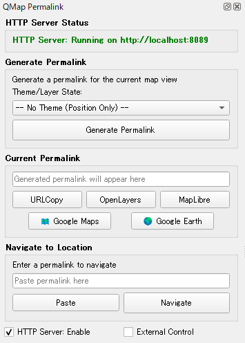
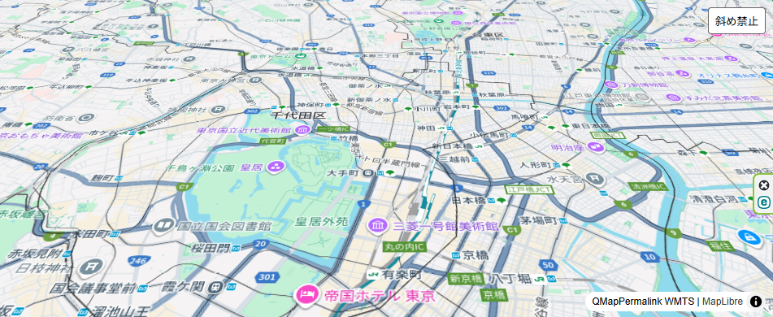

# QMapPermalink — 社内（LAN）で安全に使える、かんたん地図共有ツール

> あなたが『今見ている地図』を、そのまま社内資料（Excel / PowerPoint / PDF）の共有リンクに変えるためのツール。  
> OpenLayers / MapLibre / Google Maps / Google Earth　との連携も簡単に行えます。  

## ざっくり説明（ワンセンテンス）

QMapPermalink は QGIS の表示状態（中心位置・ズーム・レイヤ設定など）を“パーマリンク”として固定し、社内 LAN 上で安全に共有したり、Excel / PowerPoint / PDF / OpenLayers / MapLibre / Google Maps / Google Earth と簡単に連携できるツールです。  

   

## 前提条件（必須）

- QGIS が起動しており、共有したい「所定のプロジェクトファイル（.qgs/.qgz）」が開かれていること。
- 共有対象のレイヤが QGIS 上で読み込まれ、表示・スタイルが望ましい状態に整えられていること。

（注：これらが整っていないと、生成されるパーマリンクやエクスポート結果が期待どおりに復元できません。）

## なぜ QMapPermalink を社内で使うのか（QGIS と違う点）

- QGIS は編集・解析・スタイリングが得意な“作業ツール”。そのままファイルを渡すと相手で環境を揃える必要があることも。
- QMapPermalink は“共有”に特化。今見えている地図を軽量な形（URL / HTML パッケージ / 画像）で切り出し、受け手が簡単に開ける形式にします。
- 社内（LAN）での運用を前提にしているため、外部公開せずに機密データを扱いやすい設計ができます。

例えるなら：QGIS が厨房での調理、QMapPermalink は店内配膳・テイクアウトの包装・ラベル付けを担当するサービスです。

## 主な機能（社内利用にフォーカスしたハイライト）

- パーマリンク生成：現在の地図ビュー（座標・ズーム・レイヤ状態）を固定化して短い URL や内部用リンクとして出力
- ローカル（LAN）ホスティング：付属の軽量 HTTP サーバーで社内ネットワークだけに公開可能
- Office 連携：地図の静止画像（高解像度 PNG）やリンクを Excel/PowerPoint に簡単に埋め込める形式で配布資料作成可能
- PDF レポート化（手動ワークフロー）：地図スナップショット（PNG）とメタデータを出力し、PowerPoint 等から PDF に書き出すことで配布資料作成可能

## 外部マップライブラリ（OpenLayers / MapLibre / Google Maps / Google Earth）

このプロジェクトは QGIS の表示状態を外部に渡すために、いくつかのウェブ地図ライブラリや外部サービスと連携する仕組みを持っています。社内運用を前提に、各技術の役割と使い分け、注意点をまとめます。

- OpenLayers
  - リポジトリの一部では OpenLayers ベースの HTML エンドポイント（例: `/qgis-map`）を提供しており、ブラウザで QGIS の状態を簡易的に表示できます。
  - 特徴：柔軟でプラグインが豊富。WMS など既存の OGC サービスと自然に連携可能。
  - 推奨場面：社内 LAN 上で既存の WMS/WMTS をそのままブラウザで表示したいとき。
  

- MapLibre
  - 軽量な Mapbox GL JS の互換実装で、ベクタータイル中心のモダンな地図表示に向いています。`maplibre_endpoint.py` が関係する設定や出力をサポートします。
  - 特徴：高速でスタイルやベクター表現を柔軟に扱えるため、見た目重視のインタラクティブ表示に強い。
  
- Google Maps / Google Earth
  - これらは外部の商用サービスです。資料作成時に "外部での確認"（例：Google Maps で位置を素早く確認したい、Google Earth で 3D 表示を確認したい）といった用途で便利です。
   - 外部の人から受け取った Google Maps/Earth の共有リンク（住所やピン）や共有 URL から緯度・経度を取り出し、QGIS 上で同じ場所を素早く復元することができます。
  
## 使用例

1. 資料作成時
   - QGIS で地図の特定箇所を表示し、表示状態を整える
   - QMapPermalink でパーマリンクを生成する
   - Excel や PowerPoint、PDF の説明資料にそのリンクや PNG を埋め込む

2. 資料閲覧時
   - 資料内のリンクをクリックすると、QGIS 側が自動で該当箇所にジャンプ（設定済みの場合）
   - 説明スライドと地図画面が瞬時に連携し、発表やレビューがスムーズに進む

3. パネル形式での効率的なワークフロー
   - QMapPermalink のパネルを常時表示しておくことで、複数のパーマリンクを素早く生成・管理可能
   - 必要に応じて Google Maps / Google Earth と連携してブラウザでの確認をワンクリックで実施

## Office（Excel / PowerPoint）・PDF 連携ガイド（初心者向け）

以下は「パーマリンクを軸にした」簡単なワークフロー例です。

1) QGIS で見せたい地図を表示して調整（中心・ズーム・表示レイヤ）
2) プラグインで「パーマリンクを生成」
   - 結果：短い内部 URL、HTML パッケージ、PNG（高解像度）などが作られます
3) PowerPoint への組み込み（2 通り）
   - 画像で貼る：生成した PNG をスライドに挿入し、画像にパーマリンクをハイパーリンクとして設定
   - ハイブリッド：スライドに説明用画像＋URL を併記し、発表中にブラウザで詳細を表示
4) Excel での活用
   - セルにパーマリンク（ハイパーリンク）を入れておくと、担当者がクリックで同じビューを開けます
   - サムネイル列を作り、PNG を貼ってクリックでリンク先へ飛べるようにすると分かりやすい
5) PDF にまとめる
   - PowerPoint を PDF に書き出すと、地図の画像と説明を含む配布資料が作れます

## 簡単なテンプレ — Excel/PowerPoint 用（ステップ）

- 生成物フォルダ構成の例：
  - /exports/2025-10-25/map_001.png
  - /exports/2025-10-25/map_001_link.txt  （短縮された内部 URL）

- PowerPoint の作成手順（短縮）
  1. `map_001.png` をスライドに挿入
  2. 画像に `map_001_link.txt` の URL をハイパーリンクとして設定
  3. 発表スライドを PDF にエクスポートして配布（PDF にもリンクを残す）

- Excel の作成手順（短縮）
  1. サムネイル列に `map_001.png` を挿入
  2. 隣のセルにハイパーリンク（`map_001_link.txt`）を設定

## クイックスタート（社内向け・実践）

1. リポジトリを QGIS のプラグインフォルダにセットアップ
2. QGIS で地図を作る → プラグインでパーマリンクと PNG / HTML を生成
3. `http_server.py` を社内の指定サーバーで立ち上げ（管理者と相談のうえ）
4. Excel/PowerPoint に画像とリンクを挿入 → 配布用 PDF を生成

## 開発者向けメモ

まずは [`SPEC.md`](./SPEC.md) をお読みください。

このプロジェクトの設計仕様、API 仕様、期待される動作やファイルフォーマットの詳細は [`SPEC.md`](./SPEC.md) にまとまっています。開発やカスタマイズを始めるときは、以下の順で作業することをおすすめします：

1. [`SPEC.md`](./SPEC.md) を確認して、目的と期待動作を把握する。
2. 主要ファイルを把握する：`qmap_permalink.py`, `qmap_permalink_panel.py`, `qmap_webmap_generator.py`, `http_server.py`, `maplibre_endpoint.py`。
3. QGIS でプラグインを読み込み、開発中の変更を手元の QGIS で動作確認する（前提として所定の `.qgs/.qgz` を開いてください）。
4. 変更点を小さく作り、動作確認 → コミットのサイクルを回す。

## セキュリティ注意（要必読）

このツールは便利ですが、機密データを含む場合は外部公開を絶対に避けてください。外部公開が必要な場合は必ず組織の承認を得て、安全な公開手順（認証・アクセス制御・最小データ）を整備してください。

## ライセンス

本プロジェクトは GNU General Public License version 3 (GPLv3) の下で配布されています。詳細はリポジトリルートの `LICENSE` ファイルを参照してください（https://www.gnu.org/licenses/gpl-3.0.html）　。

## 免責事項

本ソフトウェアは現状のまま提供されます。明示または黙示を問わず、特定の目的への適合性や商品性を含む一切の保証を行いません。本ツールの利用により生じたいかなる損害（データ損失、業務中断、その他の損害を含む）についても、作者および配布者は責任を負いません。機密データの取り扱いや外部サービスの利用に関しては、所属組織のポリシーに従い、必要な承認を得た上で運用してください。

