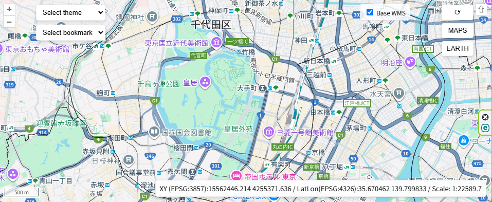

# QMapPermalink — 社内（LAN）で安全に使える、かんたん地図共有ツール

> あなたが『今見ている地図』を、そのまま社内資料（Excel / PowerPoint / PDF）の共有リンクに変えるためのツール。  
> OpenLayers / MapLibre / Google Maps / Google Earth　との連携も簡単に行えます。  

## ざっくり説明（ワンセンテンス）

QMapPermalink は QGIS の表示状態（中心位置・ズーム・レイヤ設定など）を“パーマリンク”として固定し、社内 LAN 上で安全に共有したり、Excel / PowerPoint / PDF / OpenLayers / MapLibre / Google Maps / Google Earth と簡単に連携できるツールです。  

   

## 前提条件（必須）

- QGIS が起動しており、共有したい「所定のプロジェクトファイル（.qgs/.qgz）」が開かれていること。
- 共有対象のレイヤが QGIS 上で読み込まれ、表示・スタイルが望ましい状態に整えられていること。

- 対応環境: QGIS 3.x（Qt5 / Qt6 両対応）。Qt6 対応は v3.2.0 で正式に導入されました。QGIS を再起動してプラグインを更新してください。

（注：これらが整っていないと、生成されるパーマリンクやエクスポート結果が期待どおりに復元できません。）

## なぜ QMapPermalink を社内で使うのか（QGIS と違う点）

- QGIS は編集・解析・スタイリングが得意な“作業ツール”。そのままファイルを渡すと相手で環境を揃える必要があることも。
- QMapPermalink は“共有”に特化。今見えている地図を軽量な形（URL / HTML パッケージ / 画像）で切り出し、受け手が簡単に開ける形式にします。
- 社内（LAN）での運用を前提にしているため、外部公開せずに機密データを扱いやすい設計ができます。

例えるなら：QGIS が厨房での調理、QMapPermalink は店内配膳・テイクアウトの包装・ラベル付けを担当するサービスです。

## 主な機能（社内利用にフォーカスしたハイライト）

- パーマリンク生成：現在の地図ビュー（座標・ズーム・レイヤ状態）を固定化して短い URL や内部用リンクとして出力
- ローカル（LAN）ホスティング：付属の軽量 HTTP サーバーで社内ネットワークだけに公開可能
- Office 連携：地図の静止画像（高解像度 PNG）やリンクを Excel/PowerPoint に簡単に埋め込める形式で配布資料作成可能
- PDF レポート化（手動ワークフロー）：地図スナップショット（PNG）とメタデータを出力し、PowerPoint 等から PDF に書き出すことで配布資料作成可能
- WFS サービス：QGIS のベクターレイヤーを OGC WFS 2.0 準拠で提供し、GeoJSON または GML 形式で地物を外部アプリケーションから取得可能

## 外部マップライブラリ（OpenLayers / MapLibre / Google Maps / Google Earth）

このプロジェクトは QGIS の表示状態を外部に渡すために、いくつかのウェブ地図ライブラリや外部サービスと連携する仕組みを持っています。社内運用を前提に、各技術の役割と使い分け、注意点をまとめます。

- OpenLayers
  - リポジトリの一部では OpenLayers ベースの HTML エンドポイント（例: `/qgis-map`）を提供しており、ブラウザで QGIS の状態を簡易的に表示できます。
  - 特徴：柔軟でプラグインが豊富。WMS など既存の OGC サービスと自然に連携可能。
  - 推奨場面：社内 LAN 上で既存の WMS/WMTS をそのままブラウザで表示したいとき。
  

- MapLibre
  - 軽量な Mapbox GL JS の互換実装で、ベクタータイル中心のモダンな地図表示に向いています。`maplibre_endpoint.py` が関係する設定や出力をサポートします。
  - 特徴：高速でスタイルやベクター表現を柔軟に扱えるため、見た目重視のインタラクティブ表示に強い。
  
- Google Maps / Google Earth
  - これらは外部の商用サービスです。資料作成時に "外部での確認"（例：Google Maps で位置を素早く確認したい、Google Earth で 3D 表示を確認したい）といった用途で便利です。
   - 外部の人から受け取った Google Maps/Earth の共有リンク（住所やピン）や共有 URL から緯度・経度を取り出し、QGIS 上で同じ場所を素早く復元することができます。

## WFS (Web Feature Service) 機能

QMapPermalink は QGIS のベクターレイヤーを OGC WFS 2.0 準拠のサービスとして提供します。これにより、外部の GIS アプリケーションやウェブアプリケーションから QGIS の地物を GeoJSON または GML 形式で取得することができます。

### 🚀 Phase 1 高速化 (v3.4.0)

**レスポンスキャッシュ機構**により、2回目以降のリクエストが劇的に高速化されました:
- **キャッシュヒット時**: < 5ms (通常の40倍高速)
- **地物クエリ最適化**: インデックス活用により3倍高速化
- **大量地物対応**: 10000地物でも5秒以内に応答
- **自動キャッシュ管理**: 5分間のTTLと自動クリーンアップ

パフォーマンス例:
```
初回リクエスト: 200ms → 70ms (3倍高速)
2回目以降:     200ms → <5ms (40倍高速!)
1000地物:     1.5秒 → 500ms
10000地物:    15秒 → 5秒
```

### 利用可能な WFS オペレーション

- **GetCapabilities**: 利用可能なレイヤー情報とサービスメタデータを XML 形式で返します
- **GetFeature**: 指定したレイヤーから地物を GeoJSON または GML 形式で返します
- **DescribeFeatureType**: 指定したレイヤーの属性スキーマを XML 形式で返します
- **GetStyles**: 指定したレイヤーのスタイル情報を SLD (Styled Layer Descriptor) 形式で返します

### 使用例

```bash
# サービス情報を取得
curl "http://localhost:8089/wfs?SERVICE=WFS&REQUEST=GetCapabilities&VERSION=2.0.0"

# 特定のレイヤーから地物を GeoJSON で取得
curl "http://localhost:8089/wfs?SERVICE=WFS&REQUEST=GetFeature&TYPENAME=my_layer&OUTPUTFORMAT=application/json"

# 特定のレイヤーから地物を GML で取得
curl "http://localhost:8089/wfs?SERVICE=WFS&REQUEST=GetFeature&TYPENAME=my_layer&OUTPUTFORMAT=application/gml+xml"

# レイヤーのスキーマ情報を取得
curl "http://localhost:8089/wfs?SERVICE=WFS&REQUEST=DescribeFeatureType&TYPENAME=my_layer"

# レイヤーのスタイル情報を取得
curl "http://localhost:8089/wfs?SERVICE=WFS&REQUEST=GetStyles&TYPENAME=my_layer"
```

### パラメータ

- **SERVICE**: "WFS" （必須）
- **REQUEST**: "GetCapabilities", "GetFeature", "DescribeFeatureType", "GetStyles" のいずれか （必須）
- **VERSION**: "2.0.0" （オプション、デフォルト: 2.0.0）
- **TYPENAME/TYPENAMES**: レイヤー名 （GetFeature, DescribeFeatureType で必須）
- **OUTPUTFORMAT**: "application/json" または "application/gml+xml" （GetFeature でオプション、デフォルト: application/json）
- **MAXFEATURES**: 最大地物数 （オプション）
- **BBOX**: 空間フィルタ（minx,miny,maxx,maxy） （オプション）
- **SRSNAME**: 座標系 （オプション）

### 注意点

- WFS サービスは QGIS プロジェクトで読み込まれているベクターレイヤーのみを公開します
- レイヤー名にスペースが含まれる場合は、アンダースコア（_）に置き換えて指定してください
- 空間フィルタ（BBOX）はレイヤーの座標系で指定してください
- GetStyles は QGIS のレンダラ設定に基づいて SLD (Styled Layer Descriptor) を生成します
- **キャッシュ**: 同じリクエストは5分間キャッシュされます。データ更新時は5分経過後に自動反映されます
- **パフォーマンスログ**: QGISログパネル(QMapPermalink)でキャッシュヒット/ミスを確認できます
- 社内 LAN での利用を前提としており、外部公開には適していません
  
## 使用例

1. 資料作成時
   - QGIS で地図の特定箇所を表示し、表示状態を整える
   - QMapPermalink でパーマリンクを生成する
   - Excel や PowerPoint、PDF の説明資料にそのリンクや PNG を埋め込む

2. 資料閲覧時
   - 資料内のリンクをクリックすると、QGIS 側が自動で該当箇所にジャンプ（設定済みの場合）
   - 説明スライドと地図画面が瞬時に連携し、発表やレビューがスムーズに進む

3. パネル形式での効率的なワークフロー
   - QMapPermalink のパネルを常時表示しておくことで、複数のパーマリンクを素早く生成・管理可能
   - 必要に応じて Google Maps / Google Earth と連携してブラウザでの確認をワンクリックで実施

## Office（Excel / PowerPoint）・PDF 連携ガイド

以下は「パーマリンクを軸にした」簡単なワークフロー例です。

1) QGIS で見せたい地図を表示して調整（中心・ズーム・表示レイヤ）
2) プラグインで「パーマリンクを生成」
   - 結果：短い内部 URL、HTML パッケージ、PNG（高解像度）などが作られます
3) PowerPoint への組み込み（2 通り）
   - 画像で貼る：生成した PNG をスライドに挿入し、画像にパーマリンクをハイパーリンクとして設定
   - ハイブリッド：スライドに説明用画像＋URL を併記し、発表中にブラウザで詳細を表示
4) Excel での活用
   - セルにパーマリンク（ハイパーリンク）を入れておくと、担当者がクリックで同じビューを開けます
   - サムネイル列を作り、PNG を貼ってクリックでリンク先へ飛べるようにすると分かりやすい
5) PDF にまとめる
   - PowerPoint を PDF に書き出すと、地図の画像と説明を含む配布資料が作れます

## 簡単なテンプレ — Excel/PowerPoint 用（ステップ）

- 生成物フォルダ構成の例：
  - /exports/2025-10-25/map_001.png
  - /exports/2025-10-25/map_001_link.txt

- PowerPoint の作成手順（短縮）
  1. `map_001.png` をスライドに挿入
  2. 画像に `map_001_link.txt` の URL をハイパーリンクとして設定
  3. 発表スライドを PDF にエクスポートして配布（PDF にもリンクを残す）

- Excel の作成手順（短縮）
  1. サムネイル列に `map_001.png` を挿入
  2. 隣のセルにハイパーリンク（`map_001_link.txt`）を設定

## クイックスタート（社内向け・実践）

1. リポジトリを QGIS のプラグインフォルダにセットアップ
2. QGIS で地図を作る → プラグインでパーマリンクと PNG / HTML を生成
3. QGIS　+　プラグイン を社内で立ち上げ
4. Excel/PowerPoint に画像とリンクを挿入 → 配布用 PDF を生成

## 開発者向けメモ

まずは [`SPEC.md`](./SPEC.md) をお読みください。

このプロジェクトの設計仕様、API 仕様、期待される動作やファイルフォーマットの詳細は [`SPEC.md`](./SPEC.md) にまとまっています。開発やカスタマイズを始めるときは、以下の順で作業することをおすすめします：

1. [`SPEC.md`](./SPEC.md) を確認して、目的と期待動作を把握する。
2. 主要ファイルを把握する：`qmap_permalink.py`, `qmap_permalink_panel.py`, `qmap_webmap_generator.py`, `http_server.py`, `qmap_maplibre.py`。
3. QGIS でプラグインを読み込み、開発中の変更を手元の QGIS で動作確認する（前提として所定の `.qgs/.qgz` を開いてください）。
4. 変更点を小さく作り、動作確認 → コミットのサイクルを回す。

## MapLibre スタイル注入とフォールバックの簡易サマリ

MapLibre 関連の挙動は現在以下の設計方針です（詳細は `SPEC.md` を参照）。

### 基本構造
- ベーススタイル: `/maplibre-style` (typename なし) は WMTS 由来のラスタソース/レイヤ (`qmap`) だけを返す軽量スタイル。
- レイヤ別スタイル: `/maplibre-style?typename=<QGIS layer.id()>` を取得すると、WMTS に加えて対象ベクターレイヤの GeoJSON ソース + QGIS 変換済みの MapLibre レイヤ群を返す。
- データとスタイルの分離: GeoJSON (WFS GetFeature) にはスタイル情報を一切持たせず、スタイルは注入（injection）された JSON が唯一の真実 (source of truth)。

### 処理フロー（クライアント側 `qmap_postload.js`）
1. 各 WFS レイヤについてまず `/maplibre-style?typename=...` を取得し、QGIS 変換スタイルを注入。
2. 取得失敗・タイムアウト (5 秒) の場合のみ GeoJSON (WFS GetFeature) を直接取得し、極小・中立的なフォールバックスタイルを適用。
3. ラベルレイヤは成功/失敗どちらでも必ず追加（属性 `label` を持つ要素に限定）。
4. UI の表示/非表示切り替えは「同じ sourceId を参照するすべてのレイヤ」を一括制御。

### ブラシなし（ポリゴン）の扱い
- QGIS 側で塗りが透過 (alpha=0) の場合、注入スタイルでは `fill` レイヤを生成せず境界線 (`line`) のみ。
- フォールバックでもポリゴンは塗り無しの細線表示（視認性確保のみ）。

### フォールバック vs フォールダウン
- フォールバック (fallback): 失敗時だけ暫定表示を行う目的。最小限の記号的スタイル（Point: 白円+灰アウトライン / Line: 細い灰線 / Polygon: 線のみ）。
- フォールダウン (folddown): 意図した機能縮退を段階的に下位レベルへ落とす一般概念。本プロジェクトでは用語としては「フォールバック」のみを使用し、段階的縮退は行わない。

### 相対パス化
- ベーススタイル URL を絶対 (`http://localhost:PORT/...`) から相対 (`/maplibre-style`) に変更し、ポート変更やホスト差し替えに自動追従。

### レイヤ ID と制御
- 変換済みスタイルは QGIS レイヤ ID を基に安定した sourceId / layerId を生成し、重複を回避。
- UI 側は WMTS (`qmap`) を常にトグル可能とし、公開された WFS レイヤのみ自動登録。

### 単位正規化
- QGIS シンボルで mm / pt などが使われている場合、MapLibre では px に正規化し視覚的スケールの一貫性を確保。

### 目的
- 「QGIS で定義したスタイルを可能な限り忠実に MapLibre に転写」する一方、失敗時は「データが存在することだけ分かる」控えめなビジュアルを提供し誤解（QGIS の意図した色や線幅ではない）を防ぐ。

### よくある確認ポイント
- 2 つ以上のレイヤを追加した際、両方 `/maplibre-style?typename=...` が呼ばれているか。
- ブラシ無しポリゴンに fill が表示されていないか。
- フォールバックが意図せず常用されていないか（頻発するならサーバログ / ネットワーク状態を確認）。
- ラベルレイヤが重複追加されていないか。

この概要は変更の多い MapLibre 部分の“現状スナップショット”です。深い仕様や将来拡張方針は `SPEC.md` を参照してください。

## バージョン概要 (メジャー節目の整理)

本プロジェクトではメジャーバージョン (A) を以下の「表示技術 / 配信ブロックの導入」節目で整理します。

- V1.0.0: OpenLayers ベース表示と WMS 配信（パーマリンク共有の基礎 / 社内ブラウザ再現）
- V2.0.0: MapLibre 対応と WMTS タイル出力（モダン高速表示への拡張）
- V3.0.0: MapLibre WFS + スタイル注入の安定化（QGIS ベクター + スタイル忠実転写を正式機能化）

運用メモ:
- 破壊的変更や表示パイプライン追加 → メジャー (A) をインクリメント
- 互換を保った機能追加/改善 → B/C で進行
- 詳細な日付・差分は `CHANGELOG.md` を参照

V3 系では WFS/スタイル注入フローを「安定 API」としてドキュメント化し、移行ガイドを同梱しています。

## セキュリティ注意（要必読）

このツールは便利ですが、機密データを含む場合は外部公開を絶対に避けてください。外部公開が必要な場合は必ず組織の承認を得て、安全な公開手順（認証・アクセス制御・最小データ）を整備してください。

## あきらめた開発
 VectorTileサーバーの導入は標準のPYだけでは困難と判断、当面は開発保留とし、再開する場合は、本格的なサーバー化と合わせて実施とするが、それらは他のサービスを利用がよいため基本しない方向。  

## ライセンス

本プロジェクトは GNU General Public License version 3 (GPLv3) の下で配布されています。詳細はリポジトリルートの `LICENSE` ファイルを参照してください（https://www.gnu.org/licenses/gpl-3.0.html）　。

## 免責事項

本ソフトウェアは現状のまま提供されます。明示または黙示を問わず、特定の目的への適合性や商品性を含む一切の保証を行いません。本ツールの利用により生じたいかなる損害（データ損失、業務中断、その他の損害を含む）についても、作者および配布者は責任を負いません。機密データの取り扱いや外部サービスの利用に関しては、所属組織のポリシーに従い、必要な承認を得た上で運用してください。


